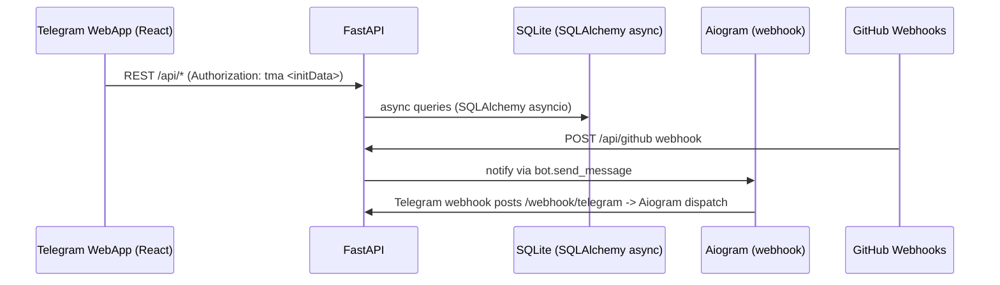

# ASM TgBot

[](https://www.python.org/) [](https://fastapi.tiangolo.com/) [](https://react.dev/) [](https://docs.docker.com/compose/)


## Overview
ASM TgBot is a Telegram Web App and backend stack for small dev teams to manage budget allocations, project contributions, and standup reporting in one workflow. It pairs a FastAPI service with an Aiogram bot and a React Mini App for in-chat budget control.

Telegram Bot Link: https://t.me/ASM_TgBot

## Tech stack & architecture reasoning

**Backend**
- Python 3.11 — selected for async performance and modern typing support.
- FastAPI — native async handling and API documentation with minimal wiring.
- Aiogram 3 — Telegram webhook handling and FSM flows for standup interaction.

**Database**
- SQLite with SQLAlchemy asyncio — lightweight persistent storage with async query support, suitable for small team workloads.

**Frontend**
- React 18 + Vite — fast local rebuilds and compact UI for Telegram WebApp runtime.
- Tailwind CSS — utility-first styling for a small interface without custom CSS architecture.
- `@twa-dev/sdk` — Telegram WebApp integration and authorization token handling.

**DevOps**
- Docker Compose — local orchestration of backend, bot, and frontend services.
- Uvicorn — ASGI server for production-style request handling.

```
Telegram WebApp -> FastAPI /api -> SQLAlchemy/SQLite
Telegram webhook -> FastAPI /webhook/telegram -> Aiogram
GitHub webhook -> FastAPI /api/github -> Telegram notify
```

## Key features
- Telegram WebApp authorization using `@twa-dev/sdk` and injected token headers.
- FastAPI routers for dashboard, project management, GitHub webhook, and bot webhook.
- Async database layer with SQLAlchemy asyncio and on-start schema initialization.
- Aiogram FSM-driven standup response collection and team invite flow.
- APScheduler-powered scheduled standup prompts and team summary dispatch.
- Static frontend serving from `frontend/dist` when available.

## The challenge
The core challenge was running the Telegram bot lifecycle and scheduler inside one FastAPI process without causing startup/shutdown races. I resolved it with a FastAPI lifespan manager that initializes the DB, registers bot routers, starts APScheduler, and sets the Telegram webhook on startup. This keeps webhook state consistent and avoids bot shutdown race conditions.

## Development & local setup
```bash
git clone https://github.com/AsmCodeOfficiall/ASM_tgbot.git
cd ASM_tgbot
cp .env.example .env
docker compose up --build
```

Alternative local setup:
```bash
cd ASM_tgbot
python -m venv .venv
source .venv/bin/activate
pip install -r api/requirements.txt
cp .env.example .env
uvicorn api.main:app --reload
```

## Project structure
```bash
.
├── api/                # FastAPI service, DB models, webhook and app routes
---
title: ASM TgBot
---

# ASM TgBot 🚀

[](https://www.python.org/) [](https://fastapi.tiangolo.com/) [](https://react.dev/) [](https://docs.docker.com/compose/)


## 1. Header & global overview

ASM TgBot is a Telegram Web App combined with a FastAPI backend and a React Mini App to manage team budgets, project submissions and daily standups, with optional GitHub event notifications sent to the team chat. It is designed for small engineering teams and team leads who want fast, chat-driven workflows for budget and status updates without a separate, heavy dashboard.

Primary stakeholders: team leads (budget oversight), developers (project and standup workflows), and DevOps (deploy + observability).

Architecture (interaction overview):



---

## 2. Team roles & contributions

| Name | Role | Primary focus |
|---|---:|---|
| Konstantin | Frontend Engineer | React 18, Vite, Tailwind, `@twa-dev/sdk` integration
| Ivan | Backend Engineer | FastAPI, Aiogram 3, FSM, APScheduler
| Bohdan | Backend / DevOps Engineer | SQLAlchemy Async, SQLite WAL, Lifespan orchestration, Docker, Nginx

Below are detailed subsections for each contributor.

### 💻 Frontend Architecture — Konstantin

Tech stack: React 18, Vite, Tailwind CSS, `@twa-dev/sdk`.

Responsibilities and technical implementation
- Implemented the Mini App UI inside Telegram WebView: single-screen SPA with modal project creation and transaction list.
- Built a small API client `fetchApi(endpoint, options)` which attaches `Authorization: tma <initData>` and performs structured error parsing. The client intentionally avoids persistent storage of `initData` and keeps tokens session-scoped.
- Designed UI to fit mobile WebView constraints: limited DOM depth, adaptive layout for keyboard overlays, and reduced initial render cost using code-splitting for non-essential components.

Security and token handling
- `initData` is read via `@twa-dev/sdk` and forwarded as a short-lived proof to the backend on each request. The backend validates the init payload.
- No long-term client-side storage of auth tokens. Session-only memory is used to reduce persistent attack surface.

Konstantin's Challenge
- Issue: WebView lifecycle events (suspend/resume, keyboard reflow) caused UI instability and duplicated state updates.
- Approach: Implemented a lightweight visibility handler (`visibilitychange` + `focus`) and a rehydration strategy to restore critical UI state after the WebView regains focus; deferred non-essential rendering and assets until user interaction.

---

### ⚙️ Core Backend & Telegram Logic — Ivan

Tech stack: FastAPI, Aiogram 3 (webhook mode), APScheduler, SQLAlchemy asyncio, Pydantic Settings.

Responsibilities and technical implementation
- Implemented API endpoints for dashboard, projects, and GitHub webhook handling.
- Integrated Aiogram in webhook mode: `/webhook/telegram` receives updates and forwards them to `Dispatcher` for handler execution.
- Implemented FSM-driven standup flow using `FSMContext` to hold per-user state; storage keys are derived from `StorageKey(bot.id, user_id, chat_id)` to avoid collisions in storage.
- Scheduler (APScheduler) is used to send prompts at configured times and aggregate responses into a single team summary.

Concurrency and scaling decisions
- Each webhook request and scheduled job uses an independent async DB session (scoped per coroutine) to avoid shared state across awaits.
- Indexed `telegram_id` and other frequent query keys to keep lookup times stable under load.

Ivan's Challenge
- Issue: Processing bursts of user responses and scheduler jobs could block the event loop if handlers performed heavy sync work.
- Approach: Converted any heavier work into async tasks (DB batch reads, incremental messaging) and wrapped per-recipient sends in try/catch so individual failures do not break an entire scheduled run. This keeps scheduler jobs short and resilient.

---

### 🗄️ Database, Infrastructure & Lifecycle — Bohdan (You)

Tech stack: SQLAlchemy 2.0 (async), SQLite (WAL mode), Docker Compose, Nginx, GitHub Webhooks.

Responsibilities and technical implementation
- Implemented async DB layer and configured SQLite in WAL mode to reduce write contention for small concurrent loads and to support concurrent readers.
- Wrote a secure GitHub webhook parser that validates `X-Hub-Signature-256` and reduces large events into summarized messages for team chat.
- Containerized the stack with `docker-compose` and added `nginx` configuration to serve static frontend assets and proxy API/webhook endpoints.

The Lifecycle Race Condition

Problem: Starting FastAPI, the Aiogram `Dispatcher`, and APScheduler in the same process risked race conditions: scheduler tasks executing before DB init, or webhook registration occurring while bot session was not ready.

Solution: a deterministic lifecycle using FastAPI `lifespan` context manager. The lifespan ensures the following sequence:

1. Initialize DB schema and connections (`init_db()`).
2. Register Aiogram routers on the `Dispatcher` so handlers are available.
3. Start `APScheduler`.
4. Set Telegram webhook (`bot.set_webhook`) as a final step.

Shutdown sequence reverses safely: stop scheduler, delete webhook (best-effort), close bot session, close DB.

Example `lifespan` (concise, explicit ordering):

```python
from contextlib import asynccontextmanager
from fastapi import FastAPI
from bot.bot_dp import bot, dp
from bot.scheduler import scheduler
from api.db import init_db
from bot.config import settings

WEBHOOK_PATH = "/webhook/telegram"

@asynccontextmanager
async def lifespan(app: FastAPI):
	# 1. Database initialization (migrations / ensure tables)
	await init_db()

	# 2. Register bot routers
	dp.include_router(...)  # handlers module imports and registration

	# 3. Start scheduler
	scheduler.start()

	# 4. Attempt to set webhook (non-fatal if it fails)
	try:
		webhook_url = f"{settings.WEBAPP_URL.rstrip('/')}{WEBHOOK_PATH}"
		await bot.set_webhook(url=webhook_url, drop_pending_updates=True)
	except Exception as exc:
		print(f"WARNING: failed to set webhook: {exc}")

	try:
		yield
	finally:
		# Teardown: stop scheduler, remove webhook, close bot session
		try:
			scheduler.shutdown(wait=False)
		except Exception:
			pass

		try:
			await bot.delete_webhook(drop_pending_updates=True)
		except Exception:
			pass

		try:
			await bot.session.close()
		except Exception:
			pass

app = FastAPI(lifespan=lifespan)
```

Notes
- SQLite WAL mode is sufficient for the current load profile; migration to Postgres is straightforward under the current SQLAlchemy model design.

---

## 3. Repository structure & code coupling

```
.
├── api/                # FastAPI service: routes, db models, webhook endpoints
├── bot/                # Aiogram router, keyboards, scheduler, messages
├── frontend/           # React Mini App (Telegram WebView)
├── deploy/             # Dockerfiles, nginx config, build recipes
├── docker-compose.yml  # Compose orchestration for dev and deploy
└── README.md           # this document
```

Coupling summary
- `frontend` calls `api` through REST with `initData` in `Authorization` header.
- `api` hosts GitHub webhook endpoints and the Telegram webhook endpoint used by the bot.
- `bot` logic is executed via `Dispatcher` after webhook updates are received by `api`.

---

## 4. Orchestration & local setup

Run everything (recommended):

```bash
git clone https://github.com/AsmCodeOfficiall/ASM_tgbot.git
cd ASM_tgbot
cp .env.example .env
docker compose up --build
```

Quick local development (backend + frontend separately):

Backend (FastAPI):
```bash
cd api
python -m venv .venv
source .venv/bin/activate
pip install -r requirements.txt
cp ../.env.example ../.env
uvicorn api.main:app --reload --port 8000
```

Frontend (React):
```bash
cd frontend
npm install
npm run dev
```

Bot (local webhook): use a tunneling tool (e.g. `ngrok`) to expose `/webhook/telegram` and set `WEBAPP_URL` appropriately in `.env`.

---

## 5. License & contacts

MIT License

Contacts
- Konstantin — Frontend Engineer — (profile link)
- Ivan — Backend Engineer — (profile link)
- Bohdan — Backend / DevOps Engineer — https://github.com/AsmCodeOfficiall

---

If you want the README extended with a `CONTRIBUTORS.md` or a per-author commit digest, say which format you prefer and I will add it.
